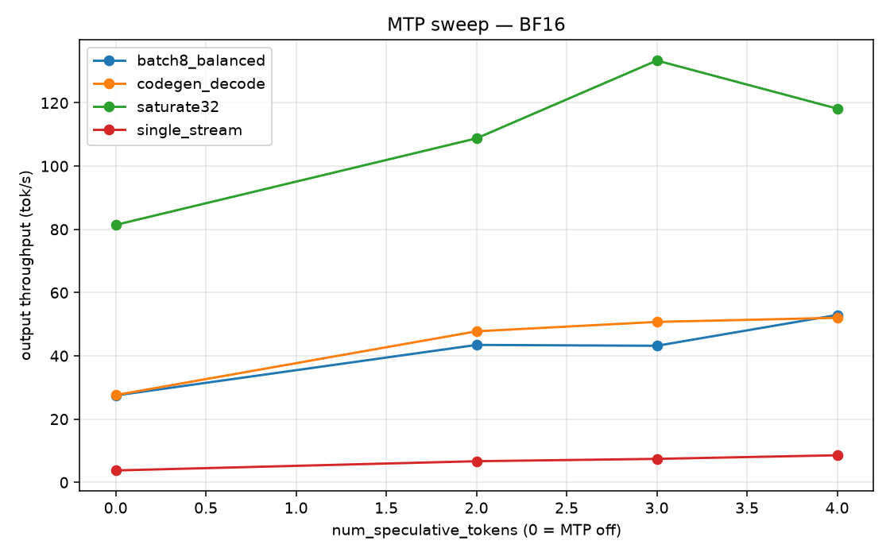
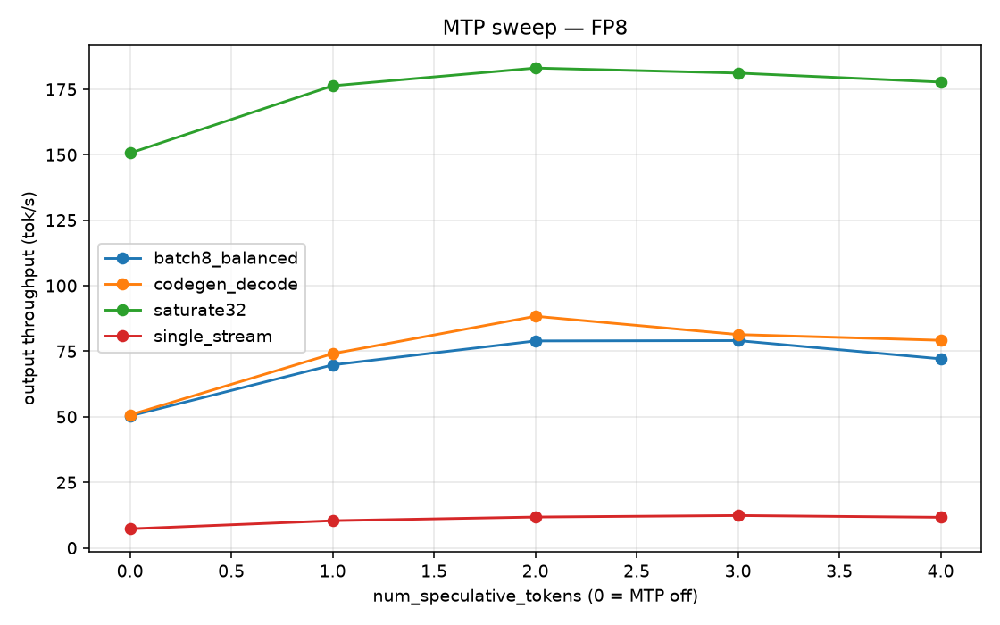
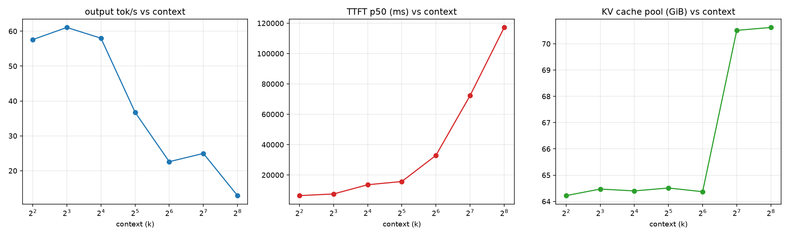
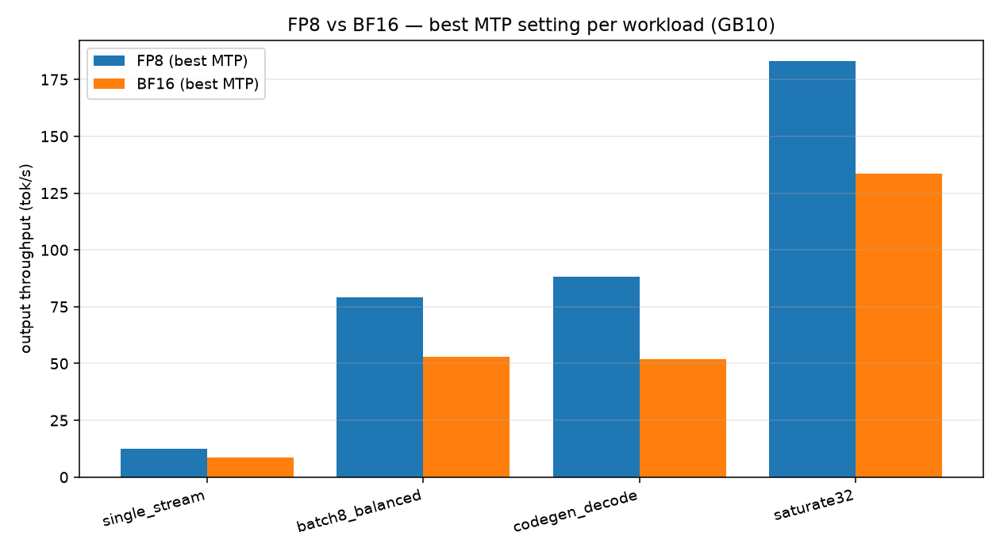

# Qwen3.8-27B-Uncensored-FP8 on DGX Spark (GB10) — benchmark report

Result dir: `models/qwen3.8-27b-fp8/bench/results/overnight_20260827_191752`  ·  43 successful runs

Served via `nvcr.io/nvidia/vllm:26.07-py3` (vLLM 0.24.0), `VLLM_USE_DEEP_GEMM=0`, FP8 block-quant weights, MTP draft head.

**Peak output throughput observed:** 183.1 tok/s (`fp8_spec_2` / `saturate32`, conc 32).

### MTP speculative-token sweep — BF16

**batch8_balanced**  (in=1024 out=1024 conc=8)

| spec tok | out tok/s | vs off | accept len | accept % | ttft p50 ms | tpot ms | mem peak MB |
| --- | --- | --- | --- | --- | --- | --- | --- |
| 0 | 27.5 | 1.00x | 0.00 |  | 5752 | 285.7 | 92786 |
| 2 | 43.5 | 1.58x | 2.31 | 65.7 | 2910 | 158.5 | 94534 |
| 3 | 43.2 | 1.57x | 2.66 | 55.3 | 2691 | 147.9 | 95386 |
| 4 | 52.9 | 1.93x | 3.00 | 50.1 | 2954 | 119.6 | 93485 |

**codegen_decode**  (in=1024 out=4096 conc=8)

| spec tok | out tok/s | vs off | accept len | accept % | ttft p50 ms | tpot ms | mem peak MB |
| --- | --- | --- | --- | --- | --- | --- | --- |
| 0 | 27.6 | 1.00x | 0.00 |  | 6807 | 288.2 | 92839 |
| 2 | 47.8 | 1.73x | 2.45 | 72.6 | 7571 | 149.6 | 94836 |
| 3 | 50.7 | 1.84x | 2.69 | 56.3 | 7742 | 132.5 | 95721 |
| 4 | 52.0 | 1.88x | 2.80 | 45.0 | 6601 | 128.3 | 93893 |

**saturate32**  (in=1024 out=1024 conc=32)

| spec tok | out tok/s | vs off | accept len | accept % | ttft p50 ms | tpot ms | mem peak MB |
| --- | --- | --- | --- | --- | --- | --- | --- |
| 0 | 81.4 | 1.00x | 0.00 |  | 8503 | 379.3 | 92936 |
| 2 | 108.8 | 1.34x | 2.32 | 66.0 | 4746 | 245.6 | 94727 |
| 3 | 133.4 | 1.64x | 2.83 | 60.8 | 3577 | 191.9 | 94780 |
| 4 | 118.2 | 1.45x | 2.97 | 49.2 | 16398 | 197.1 | 95049 |

**single_stream**  (in=512 out=1024 conc=1)

| spec tok | out tok/s | vs off | accept len | accept % | ttft p50 ms | tpot ms | mem peak MB |
| --- | --- | --- | --- | --- | --- | --- | --- |
| 0 | 3.8 | 1.00x | 0.00 |  | 613 | 264.6 | 92273 |
| 2 | 6.7 | 1.77x | 2.12 | 56.1 | 920 | 148.8 | 94142 |
| 3 | 7.4 | 1.97x | 2.53 | 51.0 | 721 | 133.9 | 94748 |
| 4 | 8.6 | 2.27x | 2.70 | 42.6 | 868 | 116.0 | 93240 |

### MTP speculative-token sweep — FP8

**batch8_balanced**  (in=1024 out=1024 conc=8)

| spec tok | out tok/s | vs off | accept len | accept % | ttft p50 ms | tpot ms | mem peak MB |
| --- | --- | --- | --- | --- | --- | --- | --- |
| 0 | 50.3 | 1.00x | 0.00 |  | 3625 | 155.2 | 89077 |
| 1 | 69.8 | 1.39x | 1.77 | 77.2 | 1791 | 104.5 | 91746 |
| 2 | 78.9 | 1.57x | 2.38 | 68.8 | 1641 | 86.5 | 92836 |
| 3 | 79.1 | 1.57x | 2.73 | 57.6 | 1922 | 82.2 | 89845 |
| 4 | 72.1 | 1.43x | 3.04 | 51.1 | 2260 | 81.5 | 90037 |

**codegen_decode**  (in=1024 out=4096 conc=8)

| spec tok | out tok/s | vs off | accept len | accept % | ttft p50 ms | tpot ms | mem peak MB |
| --- | --- | --- | --- | --- | --- | --- | --- |
| 0 | 50.7 | 1.00x | 0.00 |  | 4176 | 156.9 | 89822 |
| 1 | 74.1 | 1.46x | 1.79 | 79.5 | 4760 | 100.3 | 91997 |
| 2 | 88.4 | 1.74x | 2.45 | 72.6 | 5655 | 81.4 | 93951 |
| 3 | 81.4 | 1.61x | 2.93 | 64.4 | 5704 | 75.0 | 89833 |
| 4 | 79.2 | 1.56x | 3.04 | 51.0 | 4994 | 80.5 | 89923 |

**saturate32**  (in=1024 out=1024 conc=32)

| spec tok | out tok/s | vs off | accept len | accept % | ttft p50 ms | tpot ms | mem peak MB |
| --- | --- | --- | --- | --- | --- | --- | --- |
| 0 | 150.6 | 1.00x | 0.00 |  | 4858 | 204.5 | 89637 |
| 1 | 176.3 | 1.17x | 1.78 | 77.9 | 2835 | 156.5 | 91697 |
| 2 | 183.1 | 1.22x | 2.33 | 66.3 | 4235 | 143.1 | 90485 |
| 3 | 181.1 | 1.20x | 2.72 | 57.2 | 4331 | 138.1 | 90125 |
| 4 | 177.7 | 1.18x | 2.94 | 48.4 | 2969 | 136.6 | 89666 |

**single_stream**  (in=512 out=1024 conc=1)

| spec tok | out tok/s | vs off | accept len | accept % | ttft p50 ms | tpot ms | mem peak MB |
| --- | --- | --- | --- | --- | --- | --- | --- |
| 0 | 7.3 | 1.00x | 0.00 |  | 449 | 137.4 | 88291 |
| 1 | 10.4 | 1.43x | 1.69 | 68.6 | 552 | 96.0 | 92138 |
| 2 | 11.8 | 1.62x | 2.13 | 56.5 | 673 | 84.5 | 93321 |
| 3 | 12.3 | 1.70x | 2.46 | 48.8 | 688 | 80.5 | 89392 |
| 4 | 11.7 | 1.61x | 2.55 | 38.8 | 742 | 85.2 | 89283 |

### Context-length scaling — FP8, MTP=3

| ctx | in | out | conc | out tok/s | ttft p50 ms | tpot ms | accept len | KV GiB | KV tokens | max conc x | load s | mem peak MB |
| --- | --- | --- | --- | --- | --- | --- | --- | --- | --- | --- | --- | --- |
| 4k | 1800 | 400 | 8 | 57.6 | 6413 | 92.0 | 2.73 | 64.2 | 337k | 82.5 | 138 | 108260 |
| 8k | 3600 | 800 | 8 | 61.1 | 7511 | 96.0 | 2.61 | 64.5 | 565k | 69.0 | 149 | 108510 |
| 16k | 7200 | 1600 | 6 | 58.0 | 13580 | 79.3 | 2.99 | 64.4 | 884k | 54.0 | 132 | 108100 |
| 32k | 14000 | 3000 | 4 | 36.8 | 15708 | 84.9 | 2.63 | 64.5 | 1234k | 37.7 | 156 | 107839 |
| 64k | 28000 | 4000 | 3 | 22.6 | 32906 | 93.9 | 2.38 | 64.4 | 1533k | 23.4 | 137 | 107885 |
| 128k | 56000 | 8000 | 2 | 25.0 | 72304 | 70.2 | 3.20 | 70.5 | 1894k | 14.5 | 151 | 114376 |
| 256k | 110000 | 8000 | 1 | 12.9 | 117184 | 63.1 | 3.55 | 70.6 | 2027k | 7.7 | 153 | 112139 |

### FP8 vs BF16 — best MTP setting per workload

| workload | conc | FP8 best | BF16 best | FP8/BF16 | winner |
| --- | --- | --- | --- | --- | --- |
| single_stream | 1 | 12.3 (mtp3) | 8.6 (mtp4) | 1.44x | FP8 |
| batch8_balanced | 8 | 79.1 (mtp3) | 52.9 (mtp4) | 1.49x | FP8 |
| codegen_decode | 8 | 88.4 (mtp2) | 52.0 (mtp4) | 1.70x | FP8 |
| saturate32 | 32 | 183.1 (mtp2) | 133.4 (mtp3) | 1.37x | FP8 |

**Matched MTP token counts** (out tok/s):

| workload | spec tok | fp8 tok/s | bf16 tok/s | fp8/bf16 |
| --- | --- | --- | --- | --- |
| single_stream | 0 | 7.3 | 3.8 | 1.93x |
| single_stream | 2 | 11.8 | 6.7 | 1.76x |
| single_stream | 3 | 12.3 | 7.4 | 1.66x |
| single_stream | 4 | 11.7 | 8.6 | 1.36x |
| batch8_balanced | 0 | 50.3 | 27.5 | 1.83x |
| batch8_balanced | 2 | 78.9 | 43.5 | 1.82x |
| batch8_balanced | 3 | 79.1 | 43.2 | 1.83x |
| batch8_balanced | 4 | 72.1 | 52.9 | 1.36x |
| codegen_decode | 0 | 50.7 | 27.6 | 1.84x |
| codegen_decode | 2 | 88.4 | 47.8 | 1.85x |
| codegen_decode | 3 | 81.4 | 50.7 | 1.60x |
| codegen_decode | 4 | 79.2 | 52.0 | 1.52x |
| saturate32 | 0 | 150.6 | 81.4 | 1.85x |
| saturate32 | 2 | 183.1 | 108.8 | 1.68x |
| saturate32 | 3 | 181.1 | 133.4 | 1.36x |
| saturate32 | 4 | 177.7 | 118.2 | 1.50x |

### All runs

| config | workload | model | spec tok | conc | out tok/s | total tok/s | ttft p50 | tpot | accept len | mem peak MB | wall s |
| --- | --- | --- | --- | --- | --- | --- | --- | --- | --- | --- | --- |
| fp8_spec_off | single_stream | fp8 | 0 | 1 | 7.3 | 11.3 | 449 | 137.4 | 0.00 | 88291 | 852 |
| fp8_spec_off | batch8_balanced | fp8 | 0 | 8 | 50.3 | 103.2 | 3625 | 155.2 | 0.00 | 89077 | 476 |
| fp8_spec_off | codegen_decode | fp8 | 0 | 8 | 50.7 | 64.0 | 4176 | 156.9 | 0.00 | 89822 | 1266 |
| fp8_spec_off | saturate32 | fp8 | 0 | 32 | 150.6 | 308.9 | 4858 | 204.5 | 0.00 | 89637 | 586 |
| fp8_spec_1 | single_stream | fp8 | 1 | 1 | 10.4 | 16.1 | 552 | 96.0 | 1.69 | 92138 | 601 |
| fp8_spec_1 | batch8_balanced | fp8 | 1 | 8 | 69.8 | 143.2 | 1791 | 104.5 | 1.77 | 91746 | 348 |
| fp8_spec_1 | codegen_decode | fp8 | 1 | 8 | 74.1 | 93.5 | 4760 | 100.3 | 1.79 | 91997 | 846 |
| fp8_spec_1 | saturate32 | fp8 | 1 | 32 | 176.3 | 361.6 | 2835 | 156.5 | 1.78 | 91697 | 486 |
| fp8_spec_2 | single_stream | fp8 | 2 | 1 | 11.8 | 18.2 | 673 | 84.5 | 2.13 | 93321 | 550 |
| fp8_spec_2 | batch8_balanced | fp8 | 2 | 8 | 78.9 | 161.9 | 1641 | 86.5 | 2.38 | 92836 | 309 |
| fp8_spec_2 | codegen_decode | fp8 | 2 | 8 | 88.4 | 111.6 | 5655 | 81.4 | 2.45 | 93951 | 663 |
| fp8_spec_2 | saturate32 | fp8 | 2 | 32 | 183.1 | 375.5 | 4235 | 143.1 | 2.33 | 90485 | 459 |
| fp8_spec_3 | single_stream | fp8 | 3 | 1 | 12.3 | 19.1 | 688 | 80.5 | 2.46 | 89392 | 495 |
| fp8_spec_3 | batch8_balanced | fp8 | 3 | 8 | 79.1 | 162.2 | 1922 | 82.2 | 2.73 | 89845 | 325 |
| fp8_spec_3 | codegen_decode | fp8 | 3 | 8 | 81.4 | 102.8 | 5704 | 75.0 | 2.93 | 89833 | 766 |
| fp8_spec_3 | saturate32 | fp8 | 3 | 32 | 181.1 | 371.6 | 4331 | 138.1 | 2.72 | 90125 | 461 |
| fp8_spec_4 | single_stream | fp8 | 4 | 1 | 11.7 | 18.1 | 742 | 85.2 | 2.55 | 89283 | 572 |
| fp8_spec_4 | batch8_balanced | fp8 | 4 | 8 | 72.1 | 147.9 | 2260 | 81.5 | 3.04 | 90037 | 337 |
| fp8_spec_4 | codegen_decode | fp8 | 4 | 8 | 79.2 | 100.0 | 4994 | 80.5 | 3.04 | 89923 | 806 |
| fp8_ctx_4k | ctx4k_load | fp8 | 3 | 8 | 57.6 | 324.2 | 6413 | 92.0 | 2.73 | 108260 | 139 |
| fp8_ctx_8k | ctx8k_load | fp8 | 3 | 8 | 61.1 | 339.9 | 7511 | 96.0 | 2.61 | 108510 | 254 |
| fp8_ctx_16k | ctx16k_load | fp8 | 3 | 6 | 58.0 | 320.9 | 13580 | 79.3 | 2.99 | 108100 | 398 |
| fp8_ctx_32k | ctx32k_load | fp8 | 3 | 4 | 36.8 | 208.9 | 15708 | 84.9 | 2.63 | 107839 | 799 |
| fp8_ctx_64k | ctx64k_load | fp8 | 3 | 3 | 22.6 | 181.0 | 32906 | 93.9 | 2.38 | 107885 | 1100 |
| fp8_ctx_128k | ctx128k_load | fp8 | 3 | 2 | 25.0 | 199.9 | 72304 | 70.2 | 3.20 | 114376 | 1924 |
| fp8_ctx_256k | ctx256k_load | fp8 | 3 | 1 | 12.9 | 189.8 | 117184 | 63.1 | 3.55 | 112139 | 3023 |
| bf16_spec_off | single_stream | bf16 | 0 | 1 | 3.8 | 5.9 | 613 | 264.6 | 0.00 | 92273 | 1635 |
| bf16_spec_off | batch8_balanced | bf16 | 0 | 8 | 27.5 | 56.4 | 5752 | 285.7 | 0.00 | 92786 | 883 |
| bf16_spec_off | codegen_decode | bf16 | 0 | 8 | 27.6 | 34.9 | 6807 | 288.2 | 0.00 | 92839 | 2311 |
| bf16_spec_off | saturate32 | bf16 | 0 | 32 | 81.4 | 167.0 | 8503 | 379.3 | 0.00 | 92936 | 1092 |
| bf16_spec_2 | single_stream | bf16 | 2 | 1 | 6.7 | 10.4 | 920 | 148.8 | 2.12 | 94142 | 909 |
| bf16_spec_2 | batch8_balanced | bf16 | 2 | 8 | 43.5 | 89.1 | 2910 | 158.5 | 2.31 | 94534 | 547 |
| bf16_spec_2 | codegen_decode | bf16 | 2 | 8 | 47.8 | 60.3 | 7571 | 149.6 | 2.45 | 94836 | 1360 |
| bf16_spec_2 | saturate32 | bf16 | 2 | 32 | 108.8 | 223.1 | 4746 | 245.6 | 2.32 | 94727 | 762 |
| bf16_spec_3 | single_stream | bf16 | 3 | 1 | 7.4 | 11.5 | 721 | 133.9 | 2.53 | 94748 | 829 |
| bf16_spec_3 | batch8_balanced | bf16 | 3 | 8 | 43.2 | 88.6 | 2691 | 147.9 | 2.66 | 95386 | 552 |
| bf16_spec_3 | codegen_decode | bf16 | 3 | 8 | 50.7 | 64.1 | 7742 | 132.5 | 2.69 | 95721 | 1138 |
| bf16_spec_3 | saturate32 | bf16 | 3 | 32 | 133.4 | 273.6 | 3577 | 191.9 | 2.83 | 94780 | 632 |
| bf16_spec_4 | single_stream | bf16 | 4 | 1 | 8.6 | 13.3 | 868 | 116.0 | 2.70 | 93240 | 715 |
| bf16_spec_4 | batch8_balanced | bf16 | 4 | 8 | 52.9 | 108.6 | 2954 | 119.6 | 3.00 | 93485 | 474 |
| bf16_spec_4 | codegen_decode | bf16 | 4 | 8 | 52.0 | 65.7 | 6601 | 128.3 | 2.80 | 93893 | 1186 |
| bf16_spec_4 | saturate32 | bf16 | 4 | 32 | 118.2 | 242.4 | 16398 | 197.1 | 2.97 | 95049 | 720 |
| fp8_spec_4 | saturate32 | fp8 | 4 | 32 | 177.7 | 364.5 | 2969 | 136.6 | 2.94 | 89666 | 468 |
